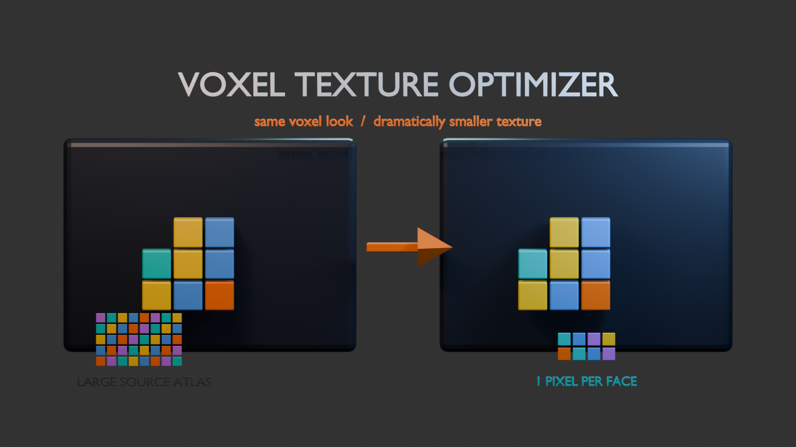

  

# Voxel Texture Optimizer

A Blender 4.0+ add-on that rebakes a voxel or retopologized mesh's texture down to **one pixel per face**, then rewrites the UVs to match.

*The visible model stays the same while the texture atlas collapses to the minimum color data needed by its faces.*

Voxel models exported from tools like MagicaVoxel often carry a texture far larger than they need — every face is a flat color, but it's sampled from a big atlas. This add-on samples the color at each face's UV center, packs those colors into the smallest square texture that fits, and remaps every face to its own single pixel.

## What it does

1. Finds the Base Color image texture on the object's first material that has one.
2. Samples the source texture at each face's UV center to get one color per face.
3. Creates a new image sized to fit `face_count` pixels — either the smallest power-of-2 rectangle (default, best GPU compatibility) or the tightest possible rectangle.
4. Writes one pixel per face and packs the image into the `.blend`.
5. Replaces all UV layers with a single `OptimizedUV` layer that maps each face onto its pixel, with a 5% inset to prevent texture bleeding.
6. Builds a new material with `Closest` interpolation and an explicit UV Map node, so glTF and other exporters pick up the right UVs.

The original material is renamed with a `_backup` suffix by default rather than deleted.

## Installation

1. Download `voxel_texture_optimizer.py`.
2. In Blender: **Edit > Preferences > Add-ons > Install...**, select the file.
3. Enable **Mesh: Voxel Texture Optimizer**.

## Usage

Select a mesh object, then open the **Voxel Tex** tab in the 3D Viewport sidebar (`N` key). The panel shows the object's face count, active UV layer, and detected source texture.

Click **Optimize Voxel Texture** to run it. Two options are available in the operator's redo panel (bottom-left):

| Option | Description |
| --- | --- |
| **Texture Size** | `Power of 2` — smallest power-of-2 rectangle that fits all faces. `Minimal` — tightest rectangle, smaller files but less GPU-friendly. |
| **Backup Original Material** | Renames the original material to `*_backup` instead of leaving it unmarked. |

## Requirements

The operator is only available when the active object:

- is a mesh,
- has an active UV layer,
- has at least one material slot with a Base Color image texture whose pixel data is loaded.

## Notes

- **All existing UV layers are removed.** The optimized layer must sit at index 0 because glTF export and several downstream tools (Blockbench and friends) default to the first UV set. Duplicate your object first if you need the original UVs.
- Faces are assumed to be flat-colored. A face whose UV center lands on a gradient will collapse to whichever single color sits at that center point.
- The new image and material are both named `<ObjectName>_VoxelOptimized`; re-running the operator replaces them.

## License

Not yet licensed — all rights reserved by default. Add a `LICENSE` file if you want to allow reuse.
